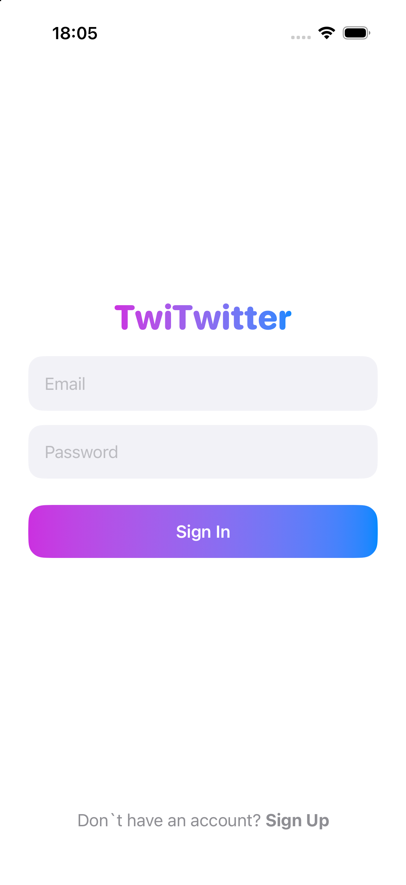
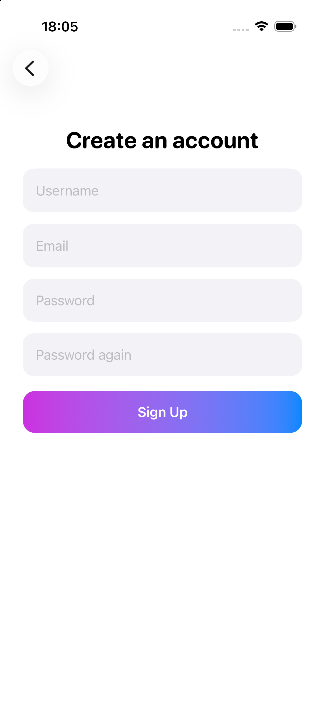
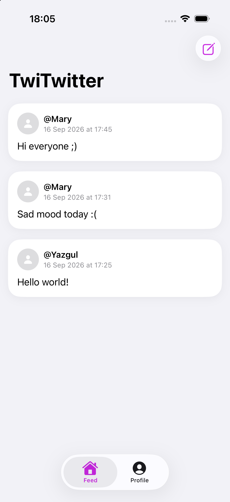
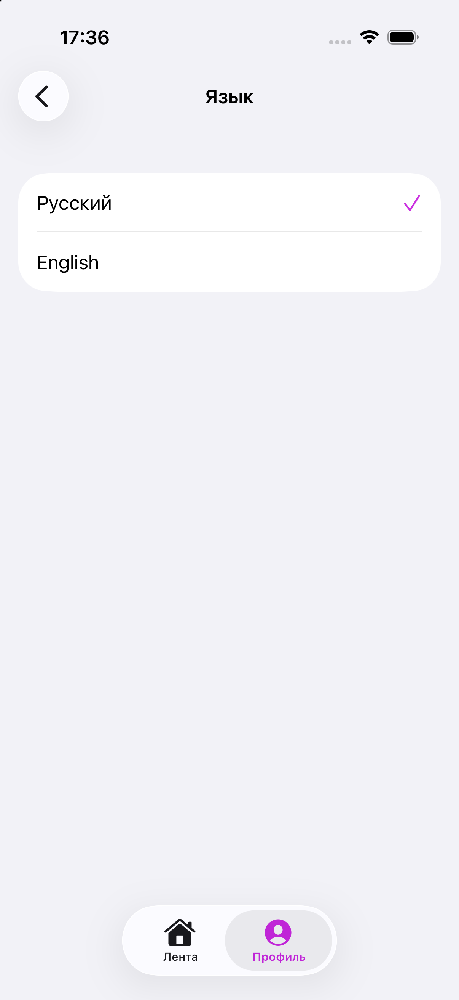

# TwiTwitter

Социальное приложение для iOS: лента постов с фото и подписями, регистрация и вход, профиль пользователя со списком его публикаций.

## Использованные технологии

| Технология | Версия | Назначение |
|---|---|---|
| **Swift** | 6.2.3 | Язык программирования |
| **SwiftUI** | iOS 26.2 SDK | Декларативный UI-фреймворк |
| **Firebase Auth** | 12.19.2 | Аутентификация и управление сессиями |
| **Cloud Firestore** | 12.19.2 | База данных |
| **Firebase Storage** | 12.19.2 | Загрузка и хранение изображений (временно недоступно) |
| **Xcode** | 26.3 | IDE для разработки |

## Скриншоты

| Вход | Регистрация |
|---|---|
|  |  |

| Лента | Профиль | Выбор языка |
|---|---|---|
|  |  |  |

## Как запустить проект

### 1. Клонируй репозиторий
git clone https://github.com/yazzgul/twitwitter-app
cd twitwitter-app
open TwiTwitter.xcodeproj

### 2. Подключи Firebase
1. Зайди на [console.firebase.google.com](https://console.firebase.google.com) и создай новый проект.
2. Добавь iOS-приложение, укажи Bundle Identifier (должен совпадать с настройками в Xcode → Signing & Capabilities).
3. Скачай `GoogleService-Info.plist` и перетащи в корень Xcode-проекта.

- Альтернативный вариант: связаться с автором @yazgulkh, для получения `GoogleService-Info.plist`

### 3. Установи зависимости
Пакеты подключены через Swift Package Manager, ничего отдельно ставить не нужно — Xcode подтянет их сам при первом открытии проекта (`File → Add Package Dependencies`, если ещё не подключены):
```
https://github.com/firebase/firebase-ios-sdk
```
Нужные модули: `FirebaseAuth`, `FirebaseFirestore`, `FirebaseFirestoreSwift`, `FirebaseStorage`, `FirebaseCore`.

### 4. Запусти
Выбери симулятор или устройство и нажми ⌘R (cmd + R).
